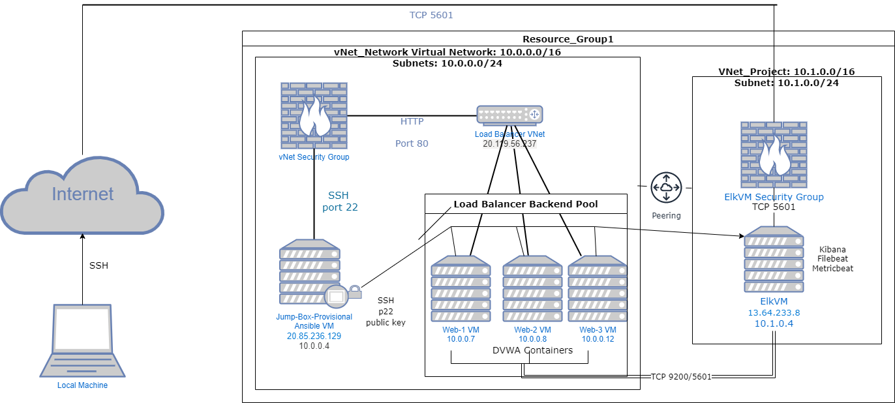
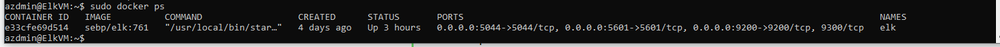

## Automated ELK Stack Deployment

The files in this repository were used to configure the network depicted below.



These files have been tested and used to generate a live ELK deployment on Azure. They can be used to either recreate the entire deployment pictured above. Alternatively, select portions of the yml and config file may be used to install only certain pieces of it, such as Filebeat.

  - [Ansible configuration playbook](Ansible/playbook.yml)
  - [Filebeat Config File](Ansible/filebeat.yml)
  - [Filebeat playbook](Ansible/filebeat-playbook.yml)
  - [Elk install playbook](Ansible/install-elk.yml)
  - [Metricbeat playbook](Ansible/metricbeat-playbook.yml)
  

This document contains the following details:
- Description of the Topology
- Access Policies
- ELK Configuration
  - Beats in Use
  - Machines Being Monitored
- How to Use the Ansible Build


### Description of the Topology

The main purpose of this network is to expose a load-balanced and monitored instance of DVWA, the D*mn Vulnerable Web Application.

Load balancing ensures that the application will be highly available, in addition to restricting access to the network.
- What aspect of security do load balancers protect? What is the advantage of a jump box?_
Load balancing protects Availability because no server gets overwhelmed with traffic. The jump box ensures that there is one point of entry for access control.

Integrating an ELK server allows users to easily monitor the vulnerable VMs for changes to the data and system logs.
- What does Filebeat watch for? Filbeat monitors logs in the specified locations.
- What does Metricbeat record? Metricbeat collects statistics and metrics and sends them to the specified services (Logstash and Elasticsearch)

The configuration details of each machine may be found below.
_Note: Use the [Markdown Table Generator](http://www.tablesgenerator.com/markdown_tables) to add/remove values from the table_.

| Name     | Function | IP Address | Operating System |
|----------|----------|------------|------------------|
| Jump Box | Gateway  | 10.0.0.1   | Linux            |
| Web-1    | Server   | 10.0.0.7   | Linux            |
| Web-2    | Server   | 10.0.0.8   | Linux            |
| Web-3    | Server   | 10.0.0.12  | Linux            |
| ElkVM    | Server   | 10.1.0.4   | Linux            |
|Load Balancer|          |20.119.56.237|                  |

### Access Policies

The machines on the internal network are not exposed to the public Internet. 

Only the Jumpbox machine can accept connections from the Internet. Access to this machine is only allowed from the following IP addresses:
- 73.131.6.110

Machines within the network can only be accessed by Jumpbox.
-Which machine did you allow to access your ELK VM? My local machine
 What was its IP address? 73.131.6.110

A summary of the access policies in place can be found in the table below.

| Name     | Publicly Accessible | Allowed IP Addresses |
|----------|---------------------|----------------------|
| Jump Box | 	No               | 73.131.6.110         |
|  ElkVM   |    No               | 73.131.6.110         |
|  Web-1   |    No               | 10.0.0.4             |
|  Web-2   |    No               | 10.0.0.4             |
|  Web-3   |    No               | 10.0.0.4             |

### Elk Configuration

Ansible was used to automate configuration of the ELK machine. No configuration was performed manually, which is advantageous because...
Ansible allows you to easily configure multiple machines through one command. Playbook allows installation of software, and configuration of multiple machines simultaneously.

The playbook implements the following tasks:
- In 3-5 bullets, explain the steps of the ELK installation play. E.g., install Docker; download image; etc._
- install docker
- install python
- increase the virtual memory
- download and launch docker elk container
  and expose ports
  5601
  9200
  5044

The following screenshot displays the result of running `docker ps` after successfully configuring the ELK instance.



### Target Machines & Beats
This ELK server is configured to monitor the following machines:
Web-1 10.0.0.7 
Web-2 10.0.0.8 
Web-3 10.0.0.12

We have installed the following Beats on these machines:
ElkVM, Web-1, Web-2, and Web-3
Beats installed were MetricBeat and FileBeat

These Beats allow us to collect the following information from each machine:
- In 1-2 sentences, explain what kind of data each beat collects, and provide 1 example of what you expect to see. E.g., `Winlogbeat` collects Windows logs, which we use to track user logon events, etc._
Filebeat collects ans ships log events: ex. system.syslog are system logs
Metricbeat collects and ships host metrics and statistics: ex. CPU usage, memory usage, inbound and outbound traffic measurements.

### Using the Playbook
In order to use the playbook, you will need to have an Ansible control node already configured. Assuming you have such a control node provisioned: 

To set up ELK server
SSH into the control node and follow the steps below:
- Copy the install-elk.yml file to /etc/ansible directory.
- Update the hosts file to include the ip addresses of the server that will be configured. 
- Run the playbook using ansible-playbook intall-elk.yml, and navigate to http:[ipaddressofelkvm]:5601/app/kibana to check that the installation worked as expected.

To set up Filebeat
SSH into control node and follow the steps below:
-Copy the filebeat-config.yml into /etc/ansible/files
-Update filebeat-playbook.yml (in /etc/ansible/roles directory) to include installer using the following command: curl -L -O https://artifacts.elastic.co/downloads/beats/filebeat/filebeat-7.6.1-amd64.deb
-Update the filebeat-config.yml file to add the ip address of the ElkVM machine where the following lines appear:

```output.elasticsearch:
  #Array of hosts to connect to.
 hosts: ["10.1.0.4:9200"]
  username: "elastic"
  password: "changeme” 
 

 setup.kibana:
  host: "10.1.0.4:5601"
```

To set up Metricbeat
SSH into control node and follow the steps below:
-Copy the metricbeat-config.yml into /etc/ansible/files
-Update metricbeat-playbook.yml (in /etc/ansible/roles directory) to include installer using the following command: curl -L -O https://artifacts.elastic.co/downloads/beats/metricbeat/metricbeat-7.6.1-amd64.deb
-Update the metricbeat-config.yml file to add the ip address of the ElkVM machine where the following lines appear:

```output.elasticsearch:
  #Array of hosts to connect to.
 hosts: ["10.1.0.4:9200"]
  username: "elastic"
  password: "changeme” 


 setup.kibana:
  host: "10.1.0.4:5601"
```
